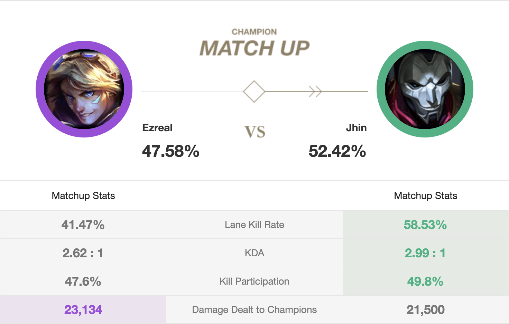
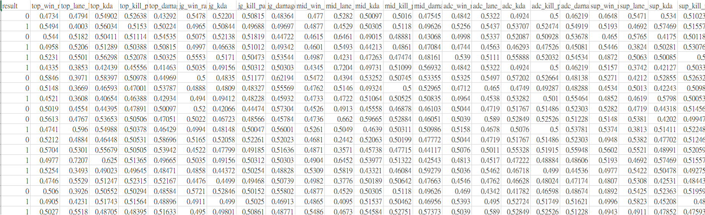
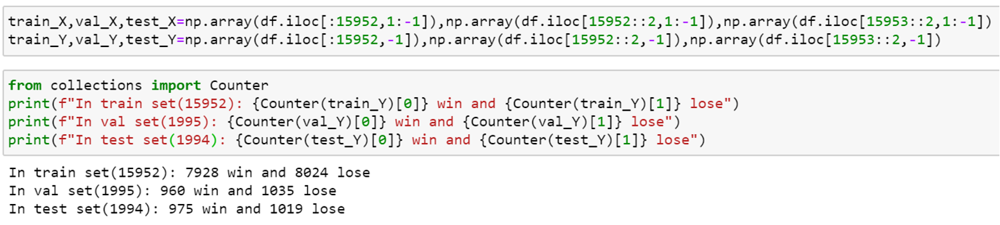
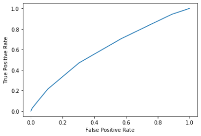

[OP.GG](https://www.op.gg/) had complete data for League of Legends, which can be used to build ML models.

## Approach
In this project, I used Korean region top 2000 players' last 20 games data.

In each game, every lane (5 lanes) had five types of data:
+ Win Rate
+ Lane Kill Rate
+ KDA
+ Kill Participation
+ Damage Dealt to Champions

As a result, there are 23 types of in each game. (Jungle position had no lane kill rate, while support position had no damage dealt)

Besides, the output Y is the result (0: red side win, 1: blue side win)

The dataset contains 19941 rows, 80% for training, 10% for validating, 10% for testing

 

## Result
AUC score: 0.61

True Win: 602 
True Lose: 550 
False Win: 425 
False Lose: 417 
Test score: 0.58

